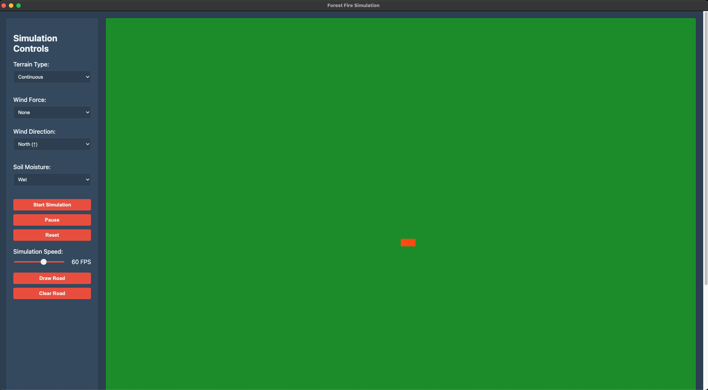

# Simulateur de Feu de Forêt 🔥

[](https://github.com/Sixpacks123/FireSimulator/releases/tag/v2.2.0)
[](https://www.electronjs.org/)


## 📋 À propos
Application de simulation de propagation de feux de forêt utilisant des automates cellulaires et une approche événementielle.

## 🚀 Démarrage Rapide

### Installation
```bash
npm install
```

### Développement
```bash
npm run start
```

### Tests
```bash
npm run test
```

## 📥 Téléchargement

Versions disponibles :
- [Version 1.1.0](https://github.com/Sixpacks123/FireSimulator/releases/tag/v2.2.0) - Dernière version
- [Version 1.0.0](https://github.com/Sixpacks123/FireSimulator/releases/tag/v1.0.0) - Version initiale no electron

## 📚 Documentation

### Spécifications Techniques
- [Cahier des charges](docs/cahier-des-charges.md)
- [Documentation technique](docs/documentation-technique.md)

### Ressources Utiles
- [Documentation Electron](https://www.electronjs.org/docs)


## 🔧 Aspects Techniques

### Points Clés
- Gestion de matrices rotatives pour la simulation du vent
- Optimisation des performances pour grandes grilles
- Système de sauvegarde/chargement de simulations

### Défis Techniques Relevés
- Optimisation des calculs matriciels
- Gestion efficace de la mémoire
- Interface utilisateur réactive

## 📝 Notes de Version
Consultez le [CHANGELOG](https://github.com/Sixpacks123/FireSimulator/releases) pour les détails des mises à jour.

## Build et Publication

### Build local

Pour créer un build local :

```bash
# Crée un package sans installeur
yarn package

# Crée un installeur pour votre plateforme
yarn make
```

### Publication

1. Mettez à jour la version dans `package.json`:
```json
{
  "version": "2.1.1"  // Incrémentez ce numéro
}
```

2. Créez un tag Git et committez :
```bash
git add .
git commit -m "Release v2.1.1"
git tag v2.1.1
git push && git push --tags
```

3. Publiez l'application sur GitHub :
```bash
yarn run publish
```

Note : Cette commande utilisera electron-forge pour publier sur GitHub. Assurez-vous d'avoir défini la variable d'environnement `GITHUB_TOKEN`.

## Configuration de la Publication

Pour configurer la publication automatique, ajoutez ces variables d'environnement :

- `GITHUB_TOKEN`: Token d'accès GitHub avec permissions `repo`
- Créez un fichier `.env` à la racine :
```
GITHUB_TOKEN=votre_token_github
```

## Structure du Projet

```
.
├── src/                # Code source
│   ├── main.ts        # Process principal
│   ├── preload.ts     # Script de preload
│   └── renderer.ts    # Process de rendu
├── assets/            # Resources statiques
├── forge.config.ts    # Configuration Electron Forge
└── vite.*.config.ts   # Configurations Vite
```

## 🧪 Tests

### Configuration
Les tests utilisent Jest avec TypeScript. Configuration dans `jest.config.js`.

### Exécution des Tests
```bash
# Lancer tous les tests
yarn test

# Lancer les tests avec couverture
yarn test --coverage

# Lancer un fichier de test spécifique
yarn test src/tests/Grid.test.ts

# Mode watch pour développement
yarn test --watch
```

### Structure des Tests
```
src/
└── tests/
    ├── Grid.test.ts     # Tests de la grille a moitier implémenté
    ├── Cell.test.ts     # Tests des cellules pas fait
    ├── Wind.test.ts     # Tests du vent pas fait
    └── Integration/     # Tests d'intégration pas fait
```

### Écrire de Nouveaux Tests
Exemple de structure de test :
```typescript
describe('Composant', () => {
  beforeEach(() => {
    // Setup
  });

  test('devrait faire quelque chose', () => {
    // Arrange
    // Act
    // Assert
  });
});
```

### Coverage
La couverture actuelle des tests :
- Grid : 80%
- Cell : À implémenter
- Wind : À implémenter
- Integration : À implémenter
```