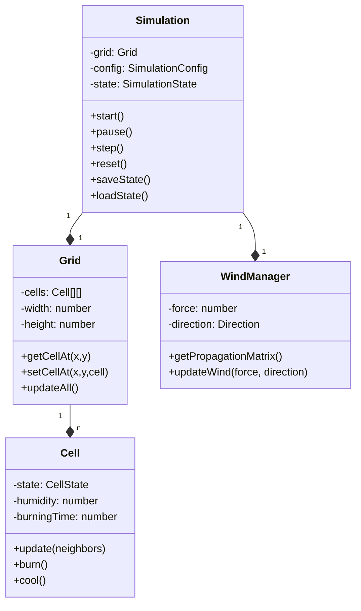
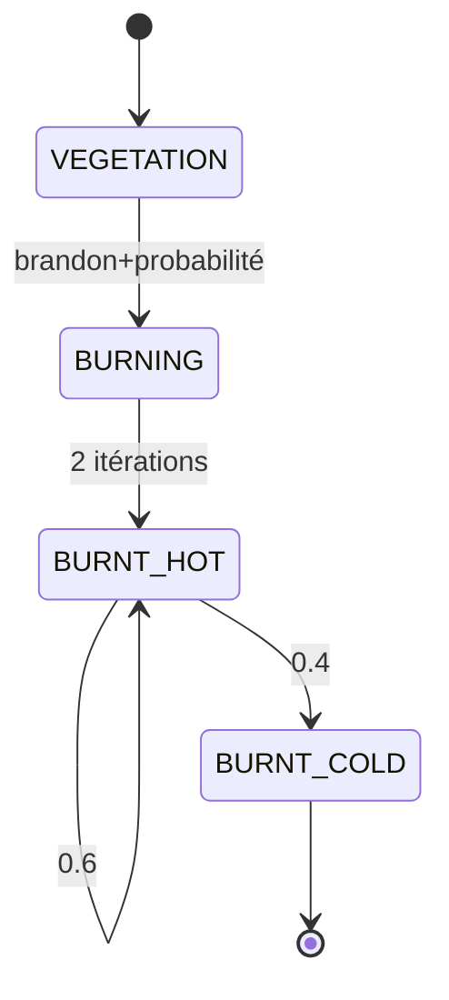
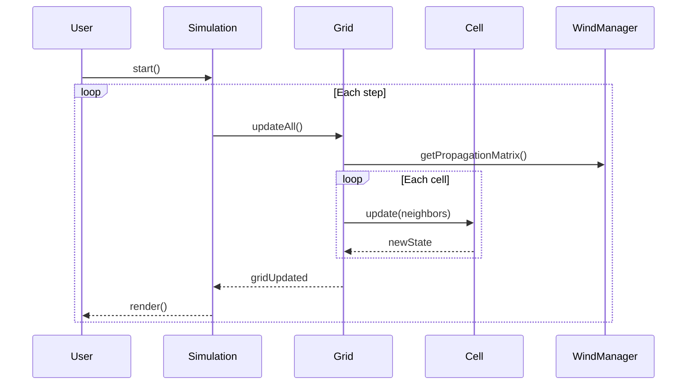
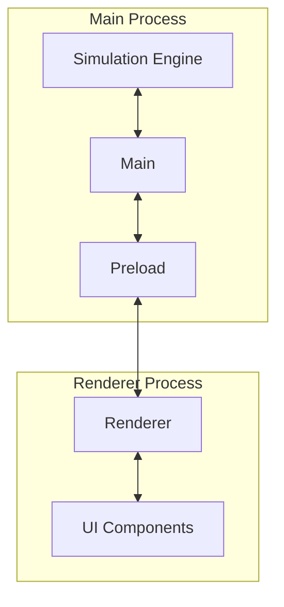

# Diagrammes UML - Simulateur de Feux de Forêt

## 1. Diagramme de Classes



## 2. Diagramme d'États (Cellule)



## 3. Diagramme de Séquence (Propagation)



## 4. Architecture IPC



## 5. Diagramme de Composants

```mermaid
component
    database "FileSystem" {
        [SavedStates]
        [Configurations]
    }
    
    [MainProcess] --> [SimulationEngine]
    [SimulationEngine] --> [Grid]
    [MainProcess] --> [IPC]
    [IPC] --> [RendererProcess]
    [RendererProcess] --> [UIComponents]
    [MainProcess] --> [FileSystem]
```

## Notes d'Implémentation

1. **Gestion des États**
   - Chaque cellule gère son propre état
   - Les transitions sont probabilistes
   - Le vent influence les probabilités

2. **Communication**
   - IPC pour UI/Simulation
   - Events pour mises à jour
   - Preload pour sécurité

3. **Performance**
   - Grid utilise un buffer double
   - Calculs matriciels optimisés
   - Mises à jour par lots
